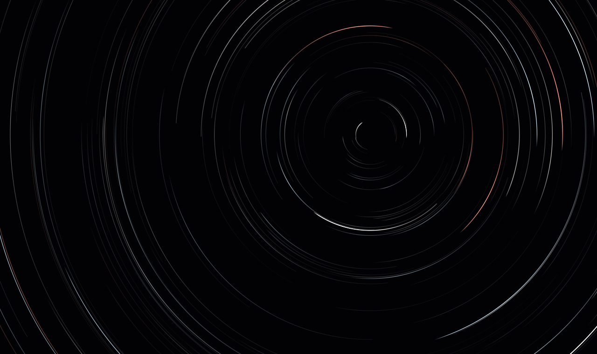
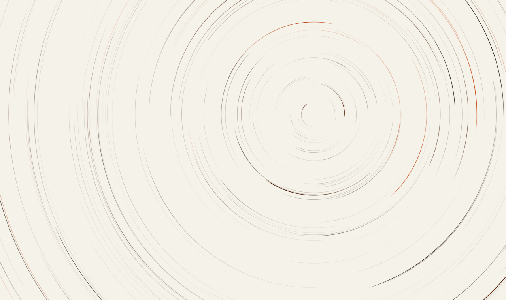
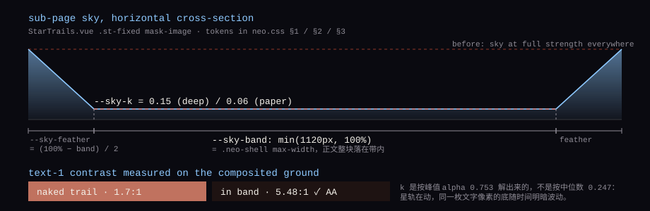
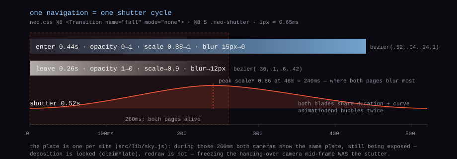

<div align="center">

# Escaping Notes

**DOPPLER DESCENT · A Long-Exposure Notebook under Star Trails**

> Ink cast into the abyss, the stars startle and never return; light hoarded in these pages, the tide recedes yet the echo remains.

[](https://vuejs.org/)
[](https://vitejs.dev/)
[](https://router.vuejs.org/)
[](src/components/neo/StarTrails.vue)
[](server/api.py)
[](#license--usage-terms)
[](https://github.com/Escap1ng/Escaping-Notes/releases)

**[Live Demo](https://escap1ng.github.io/Escaping-Notes/)** · **[escaping.top](https://escaping.top)**

[中文](README.md) · **English**

<table>
  <tr>
    <td width="50%"></td>
    <td width="50%"></td>
  </tr>
</table>

<sub>These two are **plates recomputed from the site's own constants** (`npm run art:build`), not screenshots; they were lifted by a ×2.8 / ×1.6 developing gain so the layers still read at thumbnail size — **the site itself is darker**. Stellar magnitudes follow a power law pushed toward the faint end, so most trails are meant to be dim and only a few should stand out.</sub>

</div>

---

## About

Escaping Notes is a personal writing and journal site that frames "writing" as a long exposure of the night sky. The landing screen is a camera on a tripod mid long exposure: hundreds of concentric star-trail arcs rotate rigidly around an offset celestial pole, accumulating and decaying frame by frame, while a giant ghost glyph rests between the pages as the author's mark. All four devices below grow out of that one camera —

- **Posts as variable stars** — every article is a pulsing fixed star; hover unfolds a conical diffraction cross, click to fall into the prose
- **Scroll as time** — the deeper you dive, the longer the exposure and the faster the sky turns; header to footer is one full night shoot
- **Pointer as time dilation** — star trails inside the cursor radius locally accelerate and curl
- **Easter eggs as narrative** — meteors occasionally cross the plate; click a variable star to fall into an article; a giant ghost glyph rests on every page

## Features

- **Dual themes** — Deep Space (cold white / warm white / amber trails) and Paper (astronomical dry plate: ink trails + vermilion accents), one click to switch, preference remembered; first visits follow `prefers-color-scheme`
- **Unified design system** — every screen is assembled from one set of tokens and primitives: four scales (spacing / type-size / line-height / font-weight), card tokens, buttons in "2 sizes × 4 semantics", inputs as "underline for single-line, hairline box for multi-line", three-state notices, single-character icons; no raw font sizes or spacings inside components (fluid display sizes use `clamp()`), so changing a scale updates the whole site
- **Canvas 2D rendering** — star trails are drawn frame by frame with an offscreen accumulation buffer; no third-party UI kits, chart libraries or font CDNs (the only runtime dependencies are Vue and Vue Router)
- **Graceful degradation** — when the API is unreachable (or times out) the site falls back to bundled seed data: still a complete offline plate
- **Immersive cursor (off by default)** — enabled from the third header button and remembered; it only takes over the home page, so other pages keep the native pointer; after ~1.4s of stillness it eases off and parks its render loop
- **Accessibility** — focus traps in the drawer and lightbox, route changes announced to screen readers, a focusable skip link and `#main`, touch targets ≥44px, and a full static fallback under `prefers-reduced-motion`
- **Performance** — the secondary-page backdrop is frame-capped at 30fps, resize listeners are debounced by 150ms, `--shift` is cached instead of reading `scrollHeight` per frame, persistent surfaces avoid `backdrop-filter`, and the lens glow moves by transform
- **Reading readability** — the sky under body text is dimmed by one site-wide adaptive "dark band" (strength set per theme) instead of every card wearing its own scrim; the article page adds a frosted-glass plate for long reads, and foreground contrast meets WCAG AA
- **Feedback loop** — skeleton cards while the archive loads, distinct copy for "nothing here yet" vs "no search results", and search/tag filters stored in the URL (shareable, survives reload)
- **Full-featured admin** — edit posts, updates, records and site info from `/admin`; the Records page can be refreshed from a public QQ Music playlist in one click; three role tiers; guestbook and RSS included

## Two load-bearing designs, in figures

### The dark band — readability is owned in exactly one place



The sky under body text on secondary pages is dimmed by **one** `mask-image` gradient on `StarTrails.vue`: the central `--sky-band` (aligned to the 1120px content column) drops to `--sky-k`, and each side feathers back to full strength over `--sky-feather`. Before this, only the article page had a legibility plate across 11 secondary pages, and the same text colour measured anywhere from 15.7:1 to 1.7:1 on its actual composited ground — that is the numeric shape of "hard to read, and it feels fragmented". The coefficient is solved against the **peak**, not the median, because the trails move and a given text pixel's ground brightens and dims over time. Derivation and trade-offs: [docs/design-neo.md §3.3](docs/design-neo.md#33-暗带契约天空与文字的位置协议) (Chinese).

### One navigation = one shutter cycle



Once the plate persists across routes, a page change is semantically only a shutter opening and closing. The `fall` enter and leave overlap by 260ms, and during those 260ms both cameras are looking at **the same plate, still being exposed** — `src/lib/sky.js` locks deposition only (`claimPlate`), never redraw, otherwise the camera handing over the plate freezes mid-frame, which is exactly where the "stutter on switch" came from. The two shutter blades must share duration and curve: `animationend` bubbles twice and the first one removes the layer.

## Tech Stack

| Layer | Choice |
| --- | --- |
| Frontend | Vue 3 (Composition API) + Vite 5 + Vue Router 4 |
| Rendering | Canvas 2D with an offscreen accumulation buffer (long-exposure plate simulation) |
| Styling | Plain CSS + custom-property tokens (`tokens.css` baseline / `neo.css` skin) |
| Backend | Single-file Python 3 stdlib server (`server/api.py`), no extra dependencies |
| Deployment | GitHub Pages / Vercel / nginx + systemd |

## Quick Start

Requirements: Node.js **18+**; Python 3.9+ optional (read-only browsing needs no backend).

```bash
# Clone and install
git clone https://github.com/Escap1ng/Escaping-Notes.git
cd Escaping-Notes
npm install

# Run the frontend (development)
npm run dev

# Run the backend (another terminal; without it the site runs read-only + local mode)
python server/api.py

# Production builds
npm run build          # own domain (history router) + emits dist/rss.xml, dist/sitemap.xml
npm run build:pages    # GitHub Pages mirror (hash router)
npm run preview        # preview dist/ locally
```

### Scripts

| Command | Purpose |
| --- | --- |
| `npm run dev` | Vite dev server with HMR |
| `npm run build` / `build:pages` | Production build; the latter switches on the `/Escaping-Notes/` base and hash router |
| `npm run preview` | Serve `dist/` the way production would |
| `npm run seo:build` | Regenerate SEO artefacts only (`dist/rss.xml`, `dist/sitemap.xml`) |
| `npm run og:build` | Redraw the share card `public/og.png` (1200×630, generated with Node only, committed) |
| `npm run art:build` | Redraw the two plates at the top of this page (constants are read from the source, so re-run after touching star-trail parameters) |
| `npm run font:build` | Re-subset the display font (needs Noto Serif SC locally; the output is committed, so this is rarely needed) |
| `npm run check:api` | Diffs the endpoint table in `docs/api.md` against the routes in `server/api.py`, both ways; non-zero exit on drift |
| `npm run check:docs` | Checks that every file path and section reference in the docs still resolves, and that the README route table matches `src/router` |

## Route Map

| Route | Page | Metaphor |
| --- | --- | --- |
| `/` | Home · long-exposure star trails | A camera shooting the night |
| `/blog` | Articles | Cabinet of plates |
| `/blog/:slug` | Article | Falling into a variable star |
| `/updates` | Activity | Pulse log |
| `/records` | Records | String table of tracks |
| `/projects` | Projects | Payload bay |
| `/wall` | Guestbook | Echo wall |
| `/about` | About | Writing "me" beyond the horizon |
| `/login` `/register` | Log in / Sign up | utility pages, no metaphor |
| `/admin` | Console | Backyard of the observatory |

> Any unmatched route renders the 404 page, titled 此星不在星图 ("this star is not on the chart") — site copy is Chinese-only.

## Project Structure

```text
├── index.html             # Shell: theme bootstrap script, SEO/OG metadata
├── server/api.py          # Backend: content / auth / guestbook / RSS / OG injection / record sync
├── content/posts/         # Markdown posts (frontmatter)
├── public/                # Static assets: favicon, robots.txt, og.png
├── scripts/               # Build-time and content-refresh scripts
│   ├── build_font.mjs     #   display-font subsetting (Node; needs the `subset-font` devDep)
│   ├── build_seo.mjs      #   rss.xml / sitemap.xml / og.png (Node built-ins only)
│   ├── build_readme_art.mjs#  the two plates above: recomputed from StarTrails' constants
│   ├── check_api_doc.py   #   docs/api.md ⇄ server/api.py route diff (with a --self negative control)
│   ├── check_doc_refs.py  #   drift scan over doc references / § numbers / the README route table
│   └── sync_records.py    #   fetch public QQ playlist → src/config/records.js (Python 3 stdlib; read-only mirrors)
├── docs/                  # design-neo.md design spec · manual.md handbook · api.md backend API contract
│   └── assets/readme/     # README figures (how they are made, and how to swap in real screenshots)
└── src/
    ├── assets/fonts/      # Self-hosted subset font + OFL licence
    ├── components/        # under neo/: StarTrails device · HorizonHero · NeoSiteHeader · NeoCursor …; MusicPlayer.vue sits one level up
    ├── config/            # narrative.js copy layer · site.js site info · content seeds (records.js is generated — don't hand-edit)
    ├── lib/               # api / auth / content / posts / frontmatter / markdown / theme / music / records / lens / cursor / shift / sky / debounce / focus
    ├── styles/            # tokens.css token baseline · neo.css the site skin
    └── views/             # 12 views: 9 under neo/ (home + content pages), plus AdminView / LoginView / RegisterView
```

## Deployment

Full steps for all three targets (Vercel mirror / GitHub Pages mirror / self-hosted nginx + systemd), including the nginx config and ICP filing notes, live in **[docs/manual.md §4](docs/manual.md#4-上传方法部署上线)** (Chinese). Key points:

- Login, publishing, the guestbook and cross-device view counts need the backend — only a self-hosted server runs the full version; both free platforms are read-only mirrors
- Always enable HTTPS once login is involved
- Self-hosting requires the `SITE_DIST` and `SITE_DATA` environment variables (to match the /opt + /var/www layout in the handbook); without them server-side meta injection and `/rss.xml` return 404
- Backup = copy the server's `data/` directory

## Documentation

- [docs/design-neo.md](docs/design-neo.md) — the single source of truth for the interface design (concept, colour system, component contracts, developer guide; Chinese)
- [docs/manual.md](docs/manual.md) — handbook for editing, adapting and deploying (Chinese)
- [docs/api.md](docs/api.md) — backend API contract: endpoint table, auth and rate limits, status codes, storage / fail-closed boundary, known issues; ships with `npm run check:api`, which diffs the doc against `server/api.py` both ways (Chinese)
- [docs/assets/readme/README.md](docs/assets/readme/README.md) — where these four figures come from, how to re-run them, and what to do if you want real screenshots

## License & Usage Terms

1. **Nature** — This project (source code, design documents, visual and interaction design, and copy included) is the author's personal work for learning and practice, intended solely for individual study, research and non-commercial exchange.
2. **No commercial use** — Without prior written permission, no part of this project may be used commercially or monetized in any way.
3. **Originality protection** — The core original designs (the "Long-Exposure Star Trails" metaphor, visual language and star-trail devices) may not be copied, imitated or republished under another name without permission.
4. **Citation** — Learning-purpose references must clearly credit the project and the author, and keep this notice.
5. **Disclaimer** — The project is provided "as is", without warranty of any kind; the author is not liable for any loss arising from its use.
6. **Licensing contact** — chunqi-yu@outlook.com.

Fonts: the display subset is derived from Noto Serif SC (SIL OFL 1.1); the full licence is at [src/assets/fonts/LICENSE-OFL.txt](src/assets/fonts/LICENSE-OFL.txt).

© 2026 Escap1ng · All rights reserved
