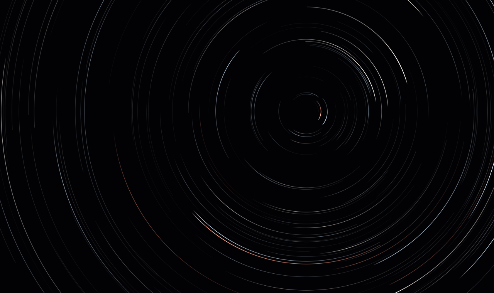
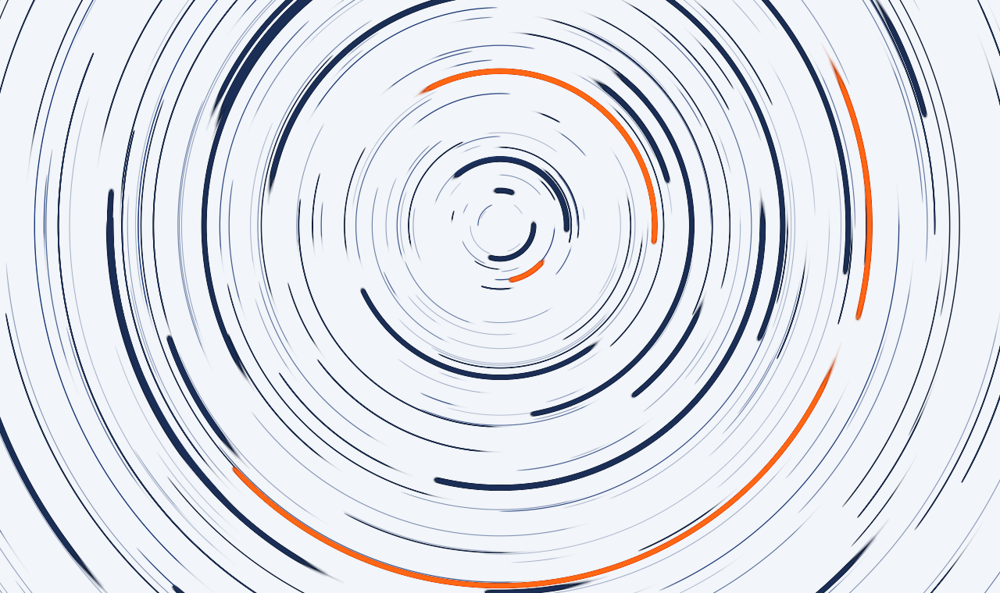
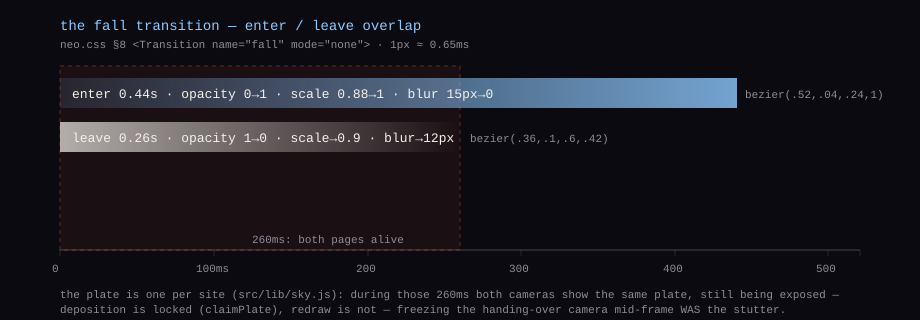

<div align="center">

# Escaping Notes · 逃逸笔记

**STAR TRAILS · A Long-Exposure Notebook**

> 掷墨入渊，星惊不复；藏光于页，潮退犹闻。

[](https://vuejs.org/)
[](https://vitejs.dev/)
[](https://router.vuejs.org/)
[](src/components/neo/StarTrails.vue)
[](server/api.py)
[](#许可与使用声明)
[](https://github.com/Escap1ng/Escaping-Notes/releases)

**[在线体验](https://escaping.top)**

[中文](README.md) · [English](README.en.md)

</div>

---

## 关于项目

Escaping Notes 是一个个人博客与记录站，把书写当作一次对夜空的长曝光——首页架着一台相机替我数着时间：文章、动态、音乐、映像、项目，都记在同一张底片上。这台相机的三条设定——

- **滚动即时间**：首屏之内越往下滑，曝光窗口越长、天空转得越快（流速 1 → 2.2 倍）；滚过 1.1 倍视口高就到底
- **指针即时间膨胀**：光标 180px 半径内的星轨局部加速卷曲，越靠中心越快（最高 2.8 倍）
- **流星即叙事**：每 6–9 秒随机落一颗，单颗活 900ms，同时在场最多 8 颗；播放器在放歌时间隔压向最短值，停下即自然回弹

星轨只在首页那一格里画。但**沉积是全站累积的**：底片像素与全站时钟都是 `src/lib/sky.js` 里的单例，换页不重铺，回到首页还是那圈越积越密的弧。折线以下交给照片。

<table>
  <tr>
    <td width="50%"></td>
    <td width="50%"></td>
  </tr>
</table>

> 左 深色 / 右 浅色：两张都是**按站点同一套常数离线复算的星轨底片**（`npm run art:build`），不是站点截图——**它们只画星轨层**；首屏实际还有一条照片地景横带、山体沿脊线遮挡星轨，以及逐字打出的站名。它们复算的正是 `prefers-reduced-motion` 用户实际看到的那张稳态底片。出图提了 ×2.8 / ×1.6 一档冲印增益，**实际观感更暗**。

## 特性

- **双主题**：深色（冷白/暖白/琥珀星轨）与浅色（天文干版底片：板岩/石墨轨迹 + 朱砂点睛），色温跟星等走（暗星冷、少数亮星抽暖）；**切换主题不换山**——暗色首屏是同一取景的压暗版（`plate-hero-deep.jpg`），两套共用一条山脊折线；底片本身按主题各沉积一张（防串色）；默认浅色，首帧刻意不读系统 `prefers-color-scheme`（首屏是一张亮底照片，跟着系统翻到深色会变成亮图压在黑底上）
- **首屏排版**：照片只占横带下沿 54%（`.hero-plate` 从 46% 起），上半屏整片留给排版；星轨以 `destination-in` 沿山脊被遮住，脊线附近保留到六成亮度、26px 羽化；站名逐字打出（起笔 260ms、每字 82ms、打满 1500ms 后光标淡退），打完才放行十六字宣言（0.9s 揭开，第二行晚 0.18s）；文字块随滚动以 0.25 倍速下沉并淡出
- **折线以下**：抽屉里是一枚本地时刻读数、三张精选卡、最近五条动态（整卡链向 `/updates`），首次进入视口时从下方拉出一次；它压在一张**全站共用**的照片底片上——五张轮播、每张 10s（周期 50s），深色主题五档指向同一张，所以夜里不跳景；模糊程度是运行时参数：设置卡里一条 0–12px 滑杆，默认拉满，偏好记在 `localStorage`
- **统一设计系统**：全部界面由同一套令牌与基元搭成——四组刻度（间距 5 档 / 字号 11 档 / 行高 4 档 / 字重 3 档）、卡片令牌、按钮「2 尺寸 × 4 语义」、输入「单行下划线 / 多行发丝框」、状态三态提示、单字符图标；组件内不写裸字号与裸间距（流体展示字号用 `clamp()` 表达），改刻度即全站同步
- **Canvas 2D 渲染**：星轨由离屏累积缓冲逐帧绘制（暗色主题星数再乘 0.65、≤720px 视口从 280 降到 140 颗）；无第三方 UI 库、图表库或字体 CDN——运行时依赖只有 Vue 与 Vue Router，展示层子集是一枚自托管 woff2
- **优雅降级**：API 不可达或超时（读 10s、上传 60s）时自动回落 `src/config/` 的本地种子数据，站点仍是完整的离线底片；后端不启动也能读完全部内容与图片
- **无障碍**：抽屉与两处灯箱有焦点陷阱（关闭后焦点回到触发元素）、路由切换向读屏播报（`role="status"`）、跳转链接与 `#main` 可聚焦、触屏（`pointer: coarse`）下按钮/链接/标签最小高 44px、`prefers-reduced-motion` 下有完整静态降级（打字机直接给全文、星轨离线冲一张 380 步稳态底片、轮播停掉只留第一张）
- **性能**：风景底片挂在 `App.vue` 上而不是每个页面里，不随路由重画；`--shift` 的滚动深度只缓存极值，不每帧读 `scrollHeight`（那等于每帧一次重排）；resize 去抖 150ms；抽屉用 `IntersectionObserver` 拉出一次即断开；卡面光斑走 transform；常驻的顶栏表面不用 `backdrop-filter`——玻璃只留给真正需要与底片隔离的三处表面
- **阅读可读性（照实说）**：一张无纱的风景照片上放裸字到不了 WCAG AA——实测最坏点在 1.0~1.8:1，与渐变形状无关（试过竖向单条、上下双纱、顶部淡入三种形状）。所以结论是**分工**：底片只当风景，正文一律落在 `.sheet` / `.neo-glass` / `.neo-card` 上，那里的前景从 5.5:1 起；`npm run check:contrast` 每次提交前重算主题令牌对平底的对比（深色 `--text-0` 18.38:1 / 浅色 16.90:1，判据 7:1），但它核的是令牌对纯色底，**不等于**核照片合成底
- **反馈闭环**：文章列表有骨架屏（3 张），「本来没有内容」与「筛选无结果」分文案，标签与关键词筛选状态写进 URL query（可分享、刷新不丢）
- **映像柜**：`/gallery` 把全站用过的图摊成一墙拍立得——站点自有 9 张（首屏两张 + 浅色五张 + 深色压暗底 + `og.png`）加全部文章封面，按 src 去重；倾斜 ±2.4° 由 src 哈希决定，进场每张错开 60ms（最多 12 张），列数 3/2/1；灯箱 `Teleport` 到 `body`，键盘 ←/→ 翻页、Esc 关闭，触屏横滑 >50px 翻页
- **全功能后台**：`/admin` 分「用户」（管理员可见）与「文章 + 设置」两档（站长可见），设置里编辑动态 / 项目 / 装备 / 歌单；鉴权是 `Authorization: Bearer`（7 天期，存 `localStorage`），限流 30 请求 / 60 秒且只计 POST；**没有自助注册端点**——账号只能由站长建；音乐页那枚「同步歌单」仅站长可见，走 `POST /api/sync/records` 由服务端重取 QQ 公开歌单

## 读图：两处承重设计

### 底片层挂在 `App.vue` 上——一处 `fixed` 的包含块陷阱



折线以下那张风景是 `App.vue` 里一层 `position: fixed` 的 `.sub-plate`，首页抽屉与全部次级页共用它。它必须挂在 `App` 上：`fall` 转场给页根加了 `filter`，而 **`filter` 会成为 `position: fixed` 后代的包含块**——同一层挂在 `HomeView` 里时实测被解析成 `.home` 的盒子（587×1629、跟着滚动），根本不是"不动的底图"。另一半承重的是**每一档轮播自带一份压暗渐变**（`transparent 18% → var(--ink-0) 78%`）：渐变若只在父层写一次，浮上来的那张会盖掉压暗，文字对比当场没了。模糊不烘进素材，是 `--plate-blur` 这个运行时参数，图层因此向四周多撑 3 倍模糊半径，免得边缘淡进透明露出一圈白边。这三条的实测过程记在 `src/App.vue` 与 `src/lib/plate.js` 的注释里。

### `fall` 叠影——两页同时在场 260ms



底片跨路由常驻之后，换页只剩 `fall` 一处转场：进入方 0.44s（模糊 15px→0、scale 0.88→1）、离开方 0.26s（0→12px、scale→0.9）并行跑，不用 `out-in`，重叠的那 **260ms** 两页同时在场、都带模糊，叠影就是这层影。这 260ms 里底片必须是同一张还在感光的像素，所以 `src/lib/sky.js` 的 `claimPlate()` **只锁沉积、不锁重绘**——交出底片那台照样每帧 draw 同一张底片，否则它会在淡出的 260ms 里冻在半帧上，那正是「切换顿挫」的真正来源。如今星轨只剩首页一台相机，转场期不再有两台并存，这段互斥实际不会触发，留着是当护栏。

## 技术栈

| 层 | 选型 |
| --- | --- |
| 前端 | Vue 3（Composition API）+ Vite 5 + Vue Router 4 |
| 渲染 | Canvas 2D 离屏累积缓冲（长曝光底片模拟） |
| 样式 | 原生 CSS + 自定义属性令牌（`tokens.css` 基线 / `neo.css` 皮肤） |
| 后端 | Python 3 标准库单文件（`server/api.py`），无第三方依赖 |
| 测试 | Node 内置 `node --test` + `python -m unittest`，零测试框架 |
| 部署 | GitHub Pages / Vercel / nginx + systemd |

## 快速开始

要求：Node.js **18+**；可选 Python 3.9+（只读浏览不需要后端）。

```bash
# 克隆并安装
git clone https://github.com/Escap1ng/Escaping-Notes.git
cd Escaping-Notes
npm install

# 启动前端（开发；/api 由 Vite 代理到 127.0.0.1:8787）
npm run dev

# 启动后端（另开终端；不启动则站点以只读 + 本地模式运行）
python server/api.py

# 生产构建
npm run build          # 自有域名（history 路由）+ 生成 dist/rss.xml、dist/sitemap.xml
npm run build:pages    # GitHub Pages 镜像（hash 路由）
npm run preview        # 本地预览 dist/
```

### 常用脚本

| 命令 | 说明 |
| --- | --- |
| `npm run dev` | Vite 开发服务器，改文件即时热更 |
| `npm run build` / `build:pages` | 生产构建；两者 `base` 都是 `/`，唯一差异是 `VITE_DEPLOY=pages`（`.env.pages`）把路由切成 hash |
| `npm run preview` | 本地模拟线上环境预览 `dist/` |
| `npm run test` | 7 个测试文件（6 个 `.mjs` + 1 个 `.py`）：frontmatter/markdown 解析、CRLF、URL 注入面、底片模糊三处默认值不漂移、首帧主题、映像柜与素材名单一致 |
| `npm run seo:build` | 只重跑 SEO 产物（`dist/rss.xml` 取最近 20 条、`dist/sitemap.xml`） |
| `npm run og:build` | 重绘分享卡片 `public/og.png`（1200×630，纯 Node 画的程序化星轨，无文字，需提交） |
| `npm run art:build` | 重绘本页顶部那两张底片图（常数从源码里正则读，读不到直接抛错；改星轨参数后要重跑） |
| `npm run bg:build` | 重烘站点底图 `public/plates/*.jpg`（首屏地景亮/暗两张 + 抽屉五张轮播 + 抽屉深色压暗底；原图在 `plates-src/`，需本机 PowerShell；产物需提交） |
| `npm run cover:build` | 重烘文章封面 `public/posts/*.jpg`（原图放在不进仓库的 `plates-src/`，改图后重跑；产物需提交） |
| `npm run font:build` | 重切展示层子集字体（需要本机装有 Noto Serif SC；产物已提交，日常不用跑） |
| `npm run check` | 下面四道门禁连跑（api / docs / naming / contrast），提交前跑这一条 |
| `npm run check:api` | `docs/api.md` 的端点表与 `server/api.py` 的路由双向对拍（当前 26 个端点），漂移即退出码非 0 |
| `npm run check:docs` | 扫文档里的文件引用与 § 节号是否还指得到东西，并核对 README 路由表与 `src/router` 一致 |
| `npm run check:naming` | 命名规约扫描，违规即退出码非 0 |
| `npm run check:contrast` | 从 `neo.css` 两组主题令牌重算 WCAG 对比度，文本令牌不达标即退出码非 0 |

## 页面地图

11 条路由全部懒加载，每条带 `meta.t` 供标题与读屏播报使用；顶栏导航只放前 7 条（`/login`、`/admin` 不进导航）。

| 路由 | 页面 | 说明 |
| --- | --- | --- |
| `/` | 首页 · 长曝光星轨 | 照片地景 + 星轨 + 打字机站名 + 抽屉 |
| `/blog` | 文章 | 文章归档，标签/关键词筛选进 URL |
| `/blog/:slug` | 正文 | 单篇正文，玻璃底板 + 封面图可点进灯箱 |
| `/updates` | 动态 | 短记录流水 |
| `/records` | 音乐 | 自托管曲目表 + 播放器卡 |
| `/gallery` | 映像 | 全站用图墙 |
| `/projects` | 项目 | 项目与状态 |
| `/about` | 关于 | 自述 · 实时读数 · 装备 · 友链 |
| `/login` | 登录 | 功能页 |
| `/admin` | 管理 | 后台编辑 |

> 第 11 条是 catch-all：任何未匹配路由落到 404 ——「这里没有页面」。

## 项目结构

```text
├── index.html             # 壳层：首帧内联脚本（主题 + 底片模糊，都不闪一下）、SEO/OG 元信息
├── server/api.py          # 后端：内容 / 鉴权 / RSS / OG 注入 / 歌单同步，监听 127.0.0.1:8787
├── content/posts/         # Markdown 文章（frontmatter）
├── public/                # 静态资源：favicon、robots.txt、og.png，以及三个**必须入库**的派生素材目录
│                          #   plates/（底图）· posts/（封面）· audio/（自托管音轨）——重烘命令见「常用脚本」
│                          #   它们的原图目录（plates-src/ · music/ · /1/）在 .gitignore 里，别当泄漏报
├── scripts/               # 构建期与内容刷新脚本（命名按动词分族）
│   ├── build_font.mjs     #   展示层子集字体裁切（Node，依赖 devDep `subset-font`）
│   ├── build_seo.mjs      #   rss.xml / sitemap.xml / og.png（纯 Node 内置模块）
│   ├── build_readme_art.mjs # 本页顶部两张底片图：按 StarTrails 常数离线复算
│   ├── build_plate_bg.ps1 / build_post_covers.ps1 # 底图与封面烘图（PowerShell + System.Drawing，CI 上跑不了）
│   ├── check_api_doc.py   #   docs/api.md ⇄ server/api.py 端点对拍（带 --self 负向对照）
│   ├── check_doc_refs.py  #   文档引用 / § 节号 / README 路由表 的漂移扫描
│   ├── check_naming.py    #   命名规约扫描
│   ├── check_contrast.mjs #   主题令牌 WCAG 对比度审计
│   ├── sync_records.py    #   抓 QQ 公开歌单 → 生成 src/config/records.js（Python3 标准库；只读镜像用）
│   ├── data/              #   脚本输入数据（GB2312 一级字表，build_font 用）
│   └── lib/               #   脚本间共用模块（PNG 编码器，build_seo 与 build_readme_art 共用）
├── docs/                  # design.md 设计依据 · manual.md 使用手册 · api.md 后端接口契约
│   └── assets/readme/     # README 配图（含生成方式与换真截图的步骤）
├── tests/                 # 零依赖防护网：node --test + unittest，跑 npm run test
└── src/
    ├── assets/fonts/      # 自托管子集字体（一枚 woff2，700 字重）+ OFL 许可
    ├── components/        # neo/ 下四件：StarTrails 星轨相机 · HorizonHero 首屏排版 · NeoSiteHeader 顶栏+抽屉 · NeoSiteFooter
    │                      #   上一层两件：MusicCard.vue（顶栏点开的播放器卡）与 SettingsCard.vue（底片模糊滑杆）
    ├── config/            # narrative.js 文案层 · site.js 站点信息 · 内容种子 8 个文件（records.js 由脚本生成，勿手改）
    ├── lib/               # api / auth / content / posts / frontmatter / markdown / theme / storage / music / records / gallery / plate / ridge / lens / shift / sky / debounce / focus
    ├── styles/            # tokens.css 令牌基线 · neo.css 全站皮肤
    └── views/             # 11 个视图平铺，一页一个文件：9 张内容页 + AdminView / LoginView
```

## 部署

三种方式（Vercel 只读镜像 / GitHub Pages 只读镜像 / 自有服务器 + nginx + systemd）的完整步骤、nginx 配置与备案注意事项见 **[docs/manual.md §4](docs/manual.md#4-上传方法部署上线)**。要点：

- GitHub Pages 镜像已绑裸域名 `escaping.top`（`www` 留给自建服务器），DNS 记录、验证命令与证书步骤见 `docs/manual.md` §4.2
- 因为域名绑的是根路径，两种构建的 `base` 都是 `/`——`build:pages` 不再带仓库名前缀，它只换路由模式
- 登录、发文、全网计数依赖后端，只有自有服务器能跑完整版；两个免费平台是只读镜像
- 涉及登录务必启用 HTTPS
- 自建服务器需设 `SITE_DIST` 与 `SITE_DATA` 两个环境变量（与手册的 /opt + /var/www 布局对齐），否则服务端 meta 注入与 `/rss.xml` 会 404
- 备份 = 复制服务器 `data/` 目录

## 文档

- [docs/design.md](docs/design.md) —— 界面设计唯一依据（概念、色彩与令牌、组件契约、开发指南）
- [docs/manual.md](docs/manual.md) —— 使用手册（编辑 / 适配 / 部署 / 常见问题）
- [docs/api.md](docs/api.md) —— 后端接口契约：端点全表、鉴权与限流、状态码、存储与 fail-closed 边界、已知缺陷。附 `npm run check:api`，把文档与 `server/api.py` 的路由双向对拍——**改端点必须同步这份文档**
- [docs/assets/readme/README.md](docs/assets/readme/README.md) —— 本页四张配图的来源、重跑方式与「想换真截图该怎么做」

## 许可与使用声明

1. **性质界定**：本项目（含源代码、设计文档、视觉与交互设计、文案等全部组成部分）系作者个人学习与实践性质的作品，仅供个人学习、研究及非商业性交流使用。
2. **禁止商用**：未经作者事先书面许可，不得将本项目全部或部分用于任何商业用途或以任何方式营利。
3. **原创保护**：未经许可，不得对核心原创设计（「长曝光星轨」隐喻、视觉语言、星轨交互装置）整体复制、仿冒或二次包装发布。
4. **学习引用**：学习性引用须显著注明项目来源与作者信息，并保留本声明。
5. **免责条款**：本项目按「现状」提供，不附任何明示或暗示的担保；因使用产生的任何损失或纠纷，作者不承担责任。
6. **授权联系**：chunqi-yu@outlook.com。

字体：展示层子集取自 Noto Serif SC（SIL OFL 1.1），许可全文见 [src/assets/fonts/LICENSE-OFL.txt](src/assets/fonts/LICENSE-OFL.txt)。

© 2026 Escap1ng · 保留所有权利
